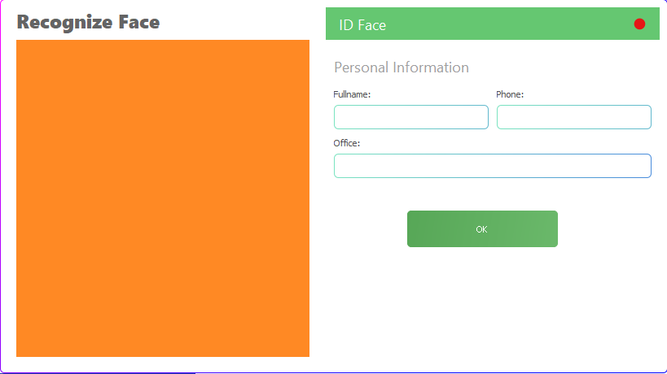

# Punch Clock: Facial Recognition Time Clock

A simple punch clock application that leverages facial recognition for user identification. Developed by Elton Massashi Takeuchi as part of the "Design and Development of Software" course in the System Analysis and Development program at Universidade São Francisco (USF).

## Table of Contents

- [Preview](#preview)
- [Features](#features)
- [Installation](#installation)
- [Usage](#usage)
- [License](#license)

## Preview

Explore the application's screens:

<div style="display: flex; flex-wrap: wrap; gap: 10px;">
  
  
  
  
</div>

## Features

- **Facial Recognition:** Uses facial recognition as the primary identification method.
- **User Registration:** Detects and registers new users with their associated data.
- **User Identification:** Identifies registered users by comparing against the database.
  
## Installation

Follow these steps to set up the project:

1. **Install Java:**
   - [JRE 8](https://www.oracle.com/java/technologies/javase-jre8-downloads.html)
   - [JDK 14](https://jdk.java.net/archive/)

2. **Set Up JavaCV:**
   - Download [JavaCV 1.5.4](https://github.com/bytedeco/javacv/releases)
   - Extract it to a folder (e.g., `C:\javacv-bin`).

3. **Clone Repository and Set Up Database:**
   - Clone the repository.
   - Create the database schema in [MySQL](https://dev.mysql.com/downloads/) using the [SQL Script](https://github.com/EMassashi/RelogioPontoReconhecimentoFacial/blob/master/SQL%20Script.sql).

4. **Open the Project:**
   - Open the project folder (located in the `RelogioPonto` directory) using the [NetBeans IDE](https://netbeans.apache.org/download/index.html).

## Usage
- Insert admin credentials in the database for the login. Example:

```sql
USE facerecognition

INSERT INTO login (username, password, isadmin)
VALUES ("user", "pass", 1)
```
- Run the project or run the view.Login class file.
- Login with the created credentials.
- Choose the register option from the menu:


- Fill the information about the person on the right side of the panel.
- Afterwards click or hold down the finish button while the camera on the left side of the panel is recognizing a face (the rectangle on the face means it is recognizing).
- To recognize the person just registered just click on the recognize option from the menu:


- If the program works it will have the rectangle on the face of the person in the camera on the left side of the panel and the data of the person on the right side of the panel with the respective labels. If you want to punch the clock just click the OK button if the data matches with the person on the camera.
- To see the records just choose the option from the menu:


- To edit people data just choose the edit option from the menu:


## License
[MIT](https://github.com/EMassashi/RelogioPontoReconhecimentoFacial/blob/master/LICENSE.txt)
